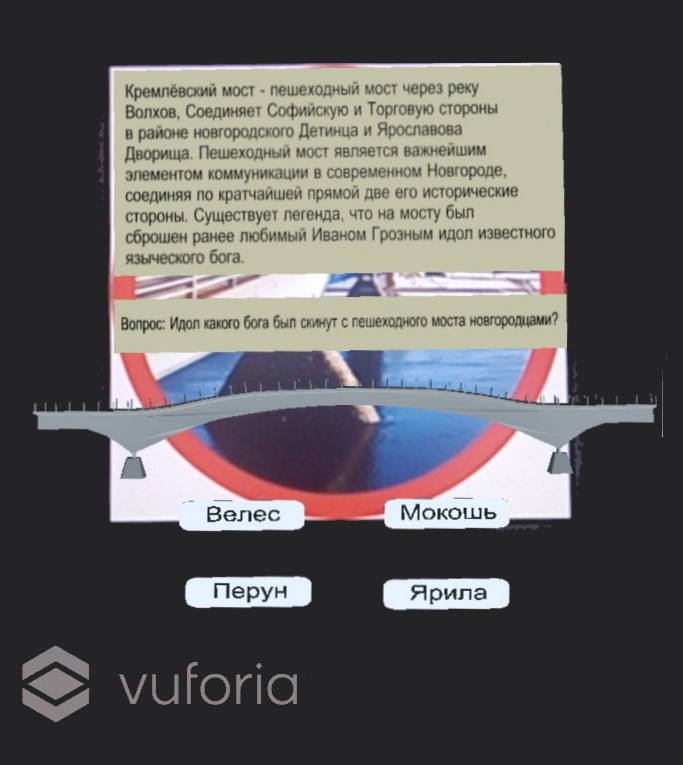

# Quest For The Novgorod Kremlin

Мобильное AR приложение для удобного и познавательного изучения достопримечательности «Новгородский кремль».

---

# Images

||
|
|
|
|
|
|
|
|
|
|
|

---

# Tech
* C#
* Vuforia
* 3D modeling
* Unity 3D

Для взаимодействия с придложением необходимо запустить установленный apk файл и наводить камеру Android устройства на метки, представленные на карте квеста.

---
# Developers
* Баканова М.В.
* Позднякова А.А.
* Скорнякова М.С.
* Чобан И.М.
---

